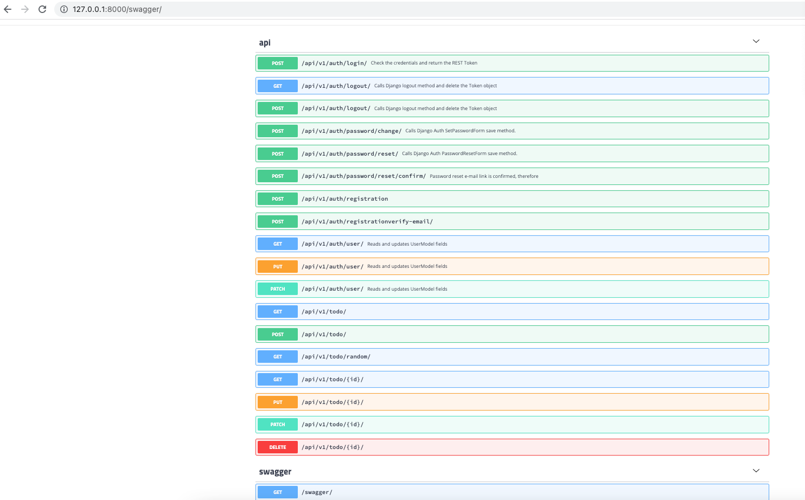
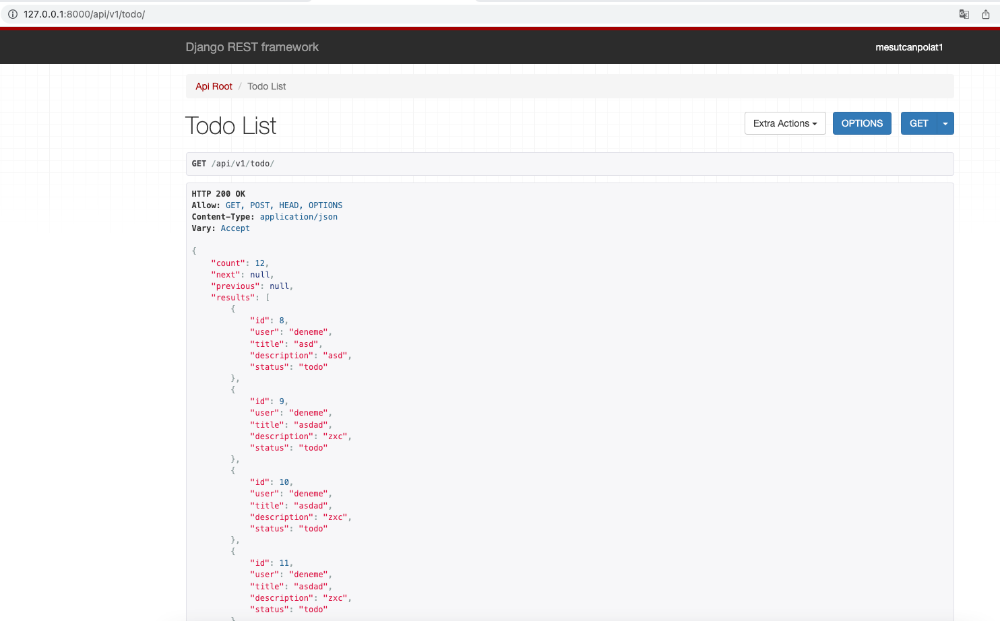

# Django-TodoListRestApi
 Django-TodoListRestApi

Python 3.7

<h3>Kurulum</h3>
- pip install requirements.txt 
- python manage.py migrate 
- python manage.py runserver

Api Döküman Linki   : /swagger/ 
Api linki           : /api/v1/

<h3>Açıklama:</h3>
- Todo crud işlemleri eklendi.  
- Random todo getirme method u eklendi.  
- Her kullanıcı sadece kendi todo sunu kontrol edebilir. 
- Login ve Register işlemleri eklendi. 
- Her sayfada 20 kayıt olacak şekilde default pagination eklendi.  
- Api dökümanı eklendi.(Swagger)

Resimler:

